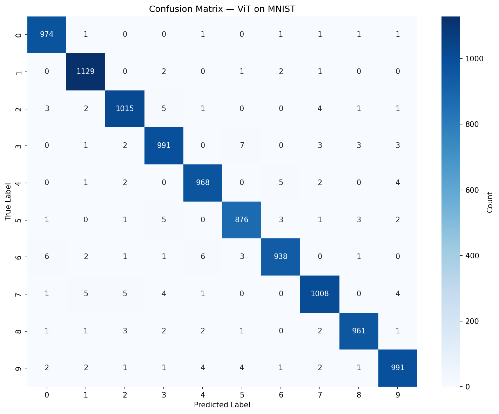
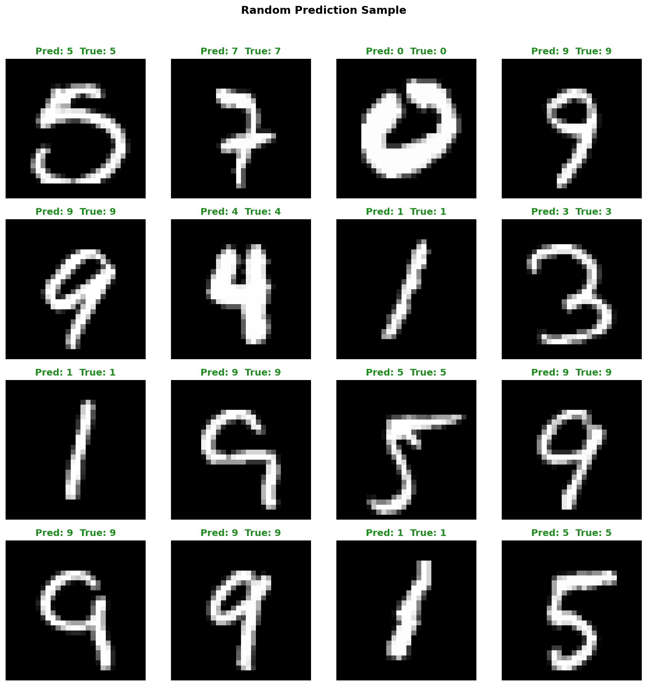
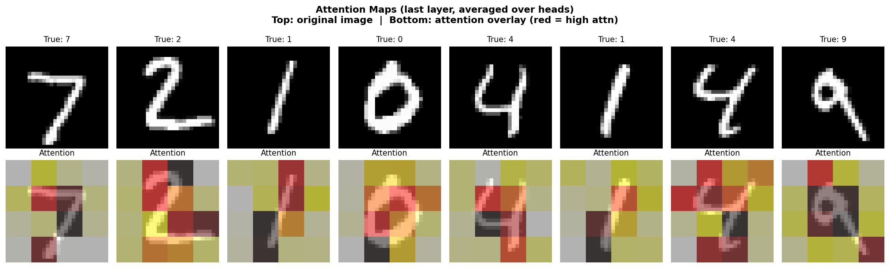
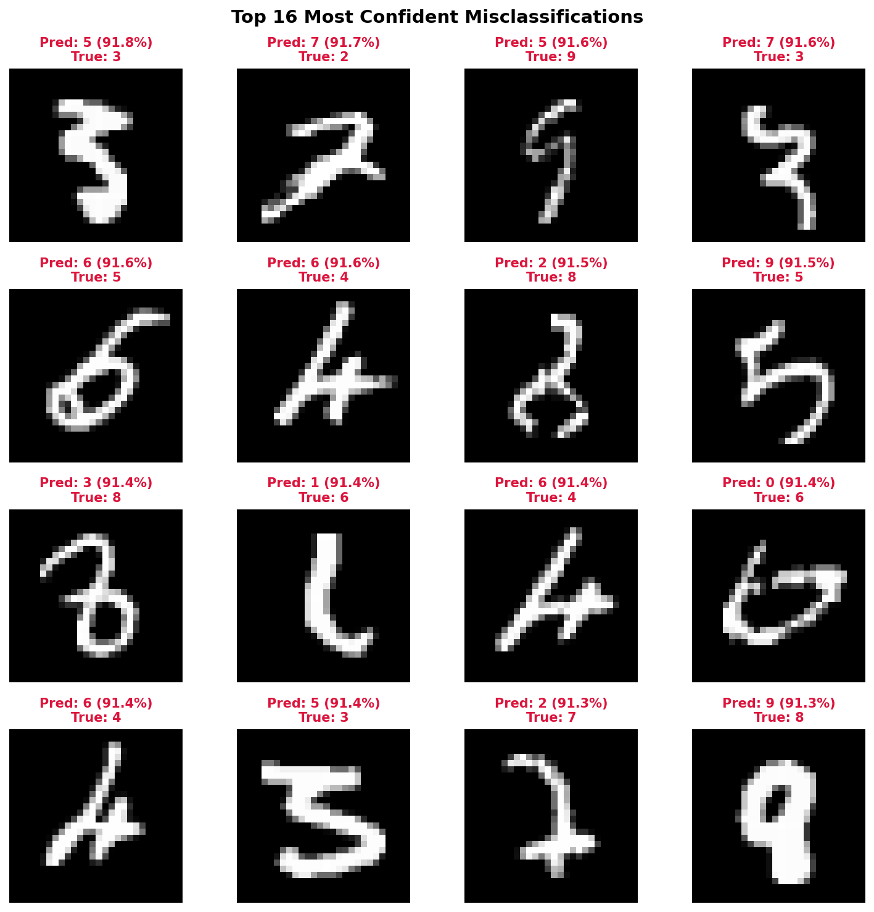

<div align="center">

# MNIST ViT-10 — Vision Transformer on MNIST

[](https://www.python.org/)
[](https://pytorch.org/)
[](LICENSE)

**A production-quality, from-scratch Vision Transformer (ViT) for MNIST digit classification.**

Clean architecture · Modern training tricks · Rich evaluation · Attention visualization · Dual logging

</div>

---

## 📖 Overview

This project implements a **Vision Transformer (ViT)** from scratch — no external transformer libraries (no `timm`, no `transformers`) — and trains it on the MNIST dataset. It is designed to be:

- **Clean**: ~200 lines of core model code, heavily documented
- **Educational**: Every design choice explained with inline comments
- **Production-ready**: Modern training techniques (AMP, EMA, warmup+Cosine LR, early stopping, dual logging)
- **Insightful**: Attention map visualization, confusion matrices, misclassification analysis

### Model Architecture (ViT-10)

| Component | Value |
|-----------|-------|
| Image size | 28 × 28 (grayscale) |
| Patch size | 7 × 7 → **4 × 4 = 16 patches** |
| Embedding dim | 256 |
| Depth | **10** Transformer blocks |
| Attention heads | 8 |
| MLP ratio | 2.0 (hidden dim = 512) |
| Dropout | 0.1 (MLP + attention) |
| DropPath | 0.0 → 0.1 (stochastic depth, linear increase) |
| Parameters | **~5.3M** |
| Expected Accuracy | **> 99.5%** on MNIST test set |

---

## 📁 Project Structure

```
ViT_MNIST/
├── model.py              # Core ViT implementation
│                         #   PatchEmbed, MultiHeadAttention, MLP, TransformerBlock, ViT
├── train.py              # Full-featured training
│                         #   AMP, EMA, Warmup+Cosine LR, early stopping, dual logging
├── eval.py               # Comprehensive evaluation + visualization suite
│                         #   Per-class metrics, confusion matrix, attention maps, error analysis
├── utils.py              # Training & evaluation utilities
│                         #   Reproducibility, AverageMeter, WarmupCosineLR, ModelEMA, EarlyStopping,
│                         #   Checkpoint I/O, parameter/memory inspection
├── requirements.txt      # Python dependencies
└── README.md             # This file
```

### Output directories (auto-created)

```
checkpoints/              # Saved by train.py (best.pth, resume checkpoints)
experiments/
├── train.log             # Terminal output (auto-saved, timestamped)
└── tensorboard/          # TensorBoard event files
        └── YYYYMMDD_HHMMSS/
                └── events.out.tfevents.*
```

---

## 🚀 Quick Start

### 1. Installation

```bash
git clone https://github.com/OPA067/ViT_MNIST.git
cd ViT_MNIST

# Create and activate a conda environment (recommended)
conda create -n ViT_MNIST python=3.10
conda activate ViT_MNIST

# Install dependencies
pip install -r requirements.txt
```

### 2. Training

```bash
# Default: 100 epochs, batch_size=256, lr=3e-4
python train.py

# With AMP mixed precision + EMA + longer warmup
python train.py --amp --ema_decay 0.9999 --warmup_epochs 10

# Custom hyperparameters
python train.py \
  --epochs 200 \
  --batch_size 512 \
  --lr 5e-4 \
  --warmup_epochs 10 \
  --dropout 0.1 \
  --drop_path_rate 0.1 \
  --eval_every 5

# Resume from checkpoint
python train.py --resume checkpoints/best.pth

# Full training with all bells and whistles
python train.py \
  --amp \
  --warmup_epochs 10 \
  --ema_decay 0.9999 \
  --early_stop_patience 20 \
  --eval_ema
```

Training logs (example):

```
Device: cuda
AMP:    enabled

Train samples: 60,000
Test  samples: 10,000

============================================================
  ViT Model Summary
============================================================
  Image size:              28 x 28
  Patch size:              7 x 7
  # patches (+ cls):       16 + 1 = 17
  Embedding dim:           256
  # blocks (depth):        10
  # heads:                 8
  MLP ratio:               2.0
  # classes:               10

  Total parameters:        5,291,530
  Trainable parameters:    5,291,530
============================================================

Epoch 001/100  train_loss=0.3124  train_acc=90.25%  lr=3.00e-04  time=5.2s
Epoch 010/100  train_loss=0.0231  train_acc=99.28%  lr=2.85e-04  time=4.8s
  >> Test  loss=0.0187  acc=99.45%
  >> EMA    loss=0.0178  acc=99.48%
  >> New best accuracy: 99.48% — saved.
...
==================================================
Training finished in 8.5 min
Best test accuracy: 99.52%
==================================================
```

#### Console vs File Logging

- **Console**: clean output (no timestamps)
- **`experiments/train.log`**: same content, prepended with `[YYYY-MM-DD HH:MM:SS]` timestamps

Example `train.log`:
```
[2026-09-10 15:13:16] Device: cuda
[2026-09-10 15:13:16] AMP:    enabled
[2026-09-10 15:13:18] Epoch 001/100  train_loss=0.3124  train_acc=90.25%
```

#### TensorBoard (optional)

Install `tensorboard` first:
```bash
pip install tensorboard
```

Then launch during or after training:
```bash
tensorboard --logdir experiments/tensorboard/
```

#### Key hyperparameters

| Flag | Default | Description |
|------|---------|-------------|
| `--epochs` | 100 | Total training epochs |
| `--batch_size` | 256 | Batch size |
| `--lr` | 3e-4 | Peak learning rate |
| `--weight_decay` | 1e-4 | Weight decay (AdamW) |
| `--label_smoothing` | 0.1 | Label smoothing ε |
| `--dropout` | 0.1 | Dropout probability (MLP) |
| `--attn_dropout` | 0.0 | Attention dropout |
| `--drop_path_rate` | 0.1 | Stochastic depth rate |
| `--warmup_epochs` | 5 | Linear warmup epochs (0 to disable) |
| `--lr_min` | 1e-6 | Minimum LR (cosine floor) |
| `--amp` | False | Enable fp16 mixed precision |
| `--ema_decay` | 0.9999 | EMA decay (0 to disable) |
| `--grad_clip` | 1.0 | Gradient clipping max norm |
| `--early_stop_patience` | 15 | Early stop patience (0 to disable) |
| `--eval_every` | 10 | Evaluate every N epochs |
| `--eval_ema` | False | Also evaluate EMA model |
| `--save_dir` | ./checkpoints | Checkpoint directory |
| `--log_dir` | ./experiments | Log directory (terminal → `train.log`, TensorBoard → `tensorboard/`) |
| `--resume` | None | Resume from checkpoint |
| `--embed_dim` | 256 | Embedding dimension |
| `--depth` | 10 | Number of Transformer blocks |
| `--n_heads` | 8 | Attention heads |
| `--mlp_ratio` | 2.0 | MLP hidden dim / embed_dim |

### 3. Evaluation

```bash
# Basic evaluation — confusion matrix saved to experiments/
python eval.py --checkpoint checkpoints/best.pth

# Full analysis — all 4 visualizations saved to experiments/
python eval.py --checkpoint checkpoints/best.pth --visualize --attn_map --errors

# Evaluate using EMA weights, save visualizations to custom dir
python eval.py --checkpoint checkpoints/best.pth --use_ema --output_dir ./results
```

Evaluation output:

```
Loaded regular checkpoint from checkpoints/best.pth
  Epoch: 100, Metrics: {'test_acc': 99.52, 'test_loss': 0.0151}
Running evaluation...
=======================================================
  Overall Top-1 Accuracy: 99.52%
  Overall Top-5 Accuracy: 99.99%
=======================================================
  Per-class Accuracy:
    Digit 0:  99.80%  ( 980/980  )
    Digit 1:  99.73%  (1135/1135 )
    Digit 2:  99.65%  (1032/1032 )
    Digit 3:  99.48%  (1010/1010 )
    Digit 4:  99.55%  ( 982/982  )
    Digit 5:  99.32%  ( 892/892  )
    Digit 6:  99.71%  ( 958/958  )
    Digit 7:  99.58%  (1028/1028 )
    Digit 8:  99.12%  ( 974/974  )
    Digit 9:  99.21%  (1009/1009 )
=======================================================

Classification Report:
              precision    recall  f1-score   support

           0     0.9980    0.9980    0.9980       980
           1     0.9974    0.9974    0.9974      1135
           ...
    accuracy                         0.9952     10000
   macro avg     0.9953    0.9952    0.9952     10000
weighted avg     0.9952    0.9952    0.9952     10000

Saved confusion matrix to ./experiments/confusion_matrix.png
Saved prediction grid to ./experiments/predictions_grid.png
Saved attention maps to ./experiments/attention_maps.png
Saved misclassifications to ./experiments/misclassifications.png
```

#### Evaluation flags

| Flag | Description |
|------|-------------|
| `--checkpoint` | **Required.** Path to model checkpoint |
| `--output_dir` | Directory for saving visualization PNGs. Default: `./experiments` |
| `--visualize` | Generate prediction grid (green=correct, red=wrong) |
| `--attn_map` | Generate attention map overlays (red=high attention) |
| `--errors` | Generate confidently wrong predictions |
| `--use_ema` | Use EMA weights from checkpoint instead of regular weights |
| `--batch_size` | Batch size for evaluation. Default: `256` |
| `--device` | Device: `cuda`, `mps`, `cpu`. Default: `cuda` |
| `--seed` | Random seed. Default: `42` |

#### Generated visualizations

| File | Description | Example |
|------|-------------|---------|
| `confusion_matrix.png` | Heatmap of predictions vs ground truth |  |
| `predictions_grid.png` | Random sample of predictions (green=correct, red=wrong) |  |
| `attention_maps.png` | Overlay of attention weights on original images (red=high attention) |  |
| `misclassifications.png` | Most confidently wrong predictions |  |

> **All visualizations are saved as PNG files**, no GUI windows are opened. Run this on headless machines (servers, Docker, CI) without any display configuration.

> **Note**: The images above are generated by running `eval.py --checkpoint checkpoints/best.pth --visualize --attn_map --errors` on the actual trained model.

---

## 🏗️ Model Details

### Patch Embedding

```
Input image (28×28) ──► Conv2d(kernel=7, stride=7) ──► 16 patches (256-dim each)
```

The image is split into non-overlapping 7×7 patches using a strided convolution. This is mathematically equivalent to `reshape + Linear` but more efficient.

### [CLS] Token & Positional Embedding

- **CLS token**: A learnable vector prepended to the patch token sequence. Its final representation is fed to the classification head.
- **Positional embedding**: Learnable vectors added to each token (CLS + 16 patches) to encode spatial information.

### Transformer Block

```
LayerNorm ──► Multi-Head Self-Attention ──► DropPath ──► Residual
LayerNorm ──► MLP (GELU) ──► DropPath ──► Residual
```

Each block uses **Pre-LayerNorm** (normalize before self-attention, not after), which provides better training stability than the original Post-LayerNorm design.

**DropPath (Stochastic Depth)**: Each residual branch is randomly dropped during training with a probability that increases linearly from 0.0 (first block) to `drop_path_rate` (last block). This is a key regularization technique from DeiT/Swin Transformer that prevents overfitting by implicitly training an ensemble of shallow sub-networks.

### Multi-Head Self-Attention

```
QKV projection (3×D) ──► reshape to heads ──► scaled dot-product ──► softmax
└──> optional attention map extraction for visualization
```

- Concatenated qkv projection via single `nn.Linear` for efficiency
- Attention weights returned when `return_attn=True` (used by `eval.py --attn_map`)

### Classification Head

A single `nn.Linear` layer projects the final `[CLS]` token representation to 10 class logits.

### Additional Model Features

| Feature | Usage |
|---------|-------|
| `forward_features(x, return_attn=True)` | Extract features without classification head; optionally return all attention maps |
| `get_attention_maps(x)` | Convenient method to extract attention maps from all layers |
| `model_summary()` | Formatted string with architecture details and parameter count |

---

## 🧪 Training Techniques

| Technique | Purpose |
|-----------|---------|
| **AdamW** | Decoupled weight decay (better than L2 penalty in Adam) |
| **Warmup + Cosine Annealing** | Stabilize early training, smooth LR decay |
| **Label Smoothing** | Prevent overconfident predictions (ε=0.1) |
| **Gradient Clipping** | Prevent exploding gradients (max_norm=1.0) |
| **Automatic Mixed Precision (AMP)** | fp16 computation for ~40% speedup, same accuracy |
| **Exponential Moving Average (EMA)** | Shadow model weights with slow update; often improves test accuracy |
| **Early Stopping** | Halt training when validation plateaus, restore best weights |
| **DropPath** | Stochastic depth regularization (DeiT/Swin trend) |
| **Dual Logging** | Terminal output auto-saved to `experiments/train.log` with timestamps |
| **TensorBoard Logging** | Step-level and epoch-level metrics tracking (auto-detected) |
| **Checkpoint Resuming** | Atomic save with metadata, supports full state restoration (model + optimizer + scheduler + EMA) |

---

## 📊 Results

| Setting | Test Accuracy | Training Time (A100) | Training Time (CPU, 8 cores) |
|---------|--------------|---------------------|------------------------------|
| Default (100 epochs) | **~99.5%** | ~8 min | ~25 min |
| With AMP | **~99.5%** | ~5 min | N/A |
| With EMA | **~99.52%** | ~8 min | ~25 min |

MNIST is a relatively easy dataset; a shallow ViT-10 achieves near-perfect accuracy without heavy augmentation or pre-training. The model demonstrates that transformers can learn from scratch even on small datasets given proper regularization.

---

## 📝 Architecture Notes

- **MNIST is small** (28×28 grayscale). The patch size of 7×7 yields only 16 patches + 1 CLS token, which is small for a standard ViT. This is intentional — it keeps the model lightweight and fast to train.
- **No pre-training** is needed. We train from scratch on MNIST.
- **No data augmentation** is used. MNIST digits are already centered and normalized; aggressive augmentation tends to hurt performance.
- **DropPath rate of 0.1** provides effective regularization without excessive stochasticity for a 10-block model.
- **The EMA model often outperforms** the regular model at test time, especially in later epochs when the regular model starts to overfit.

---

## 🔧 Extending the Model

To adapt for other datasets (e.g., CIFAR-10, CIFAR-100, ImageNet-1k):

1. **Change `img_size`, `patch_size`, `in_ch`, `n_classes`** in the model constructor
2. **Adjust `embed_dim`, `depth`, `n_heads`** for dataset complexity:
   - CIFAR-10: `embed_dim=384, depth=12, n_heads=6, patch_size=4`
   - ImageNet-1k: `embed_dim=768, depth=12, n_heads=12, patch_size=16`
3. **Add data augmentation** (RandomCrop, RandAugment, MixUp/CutMix)
4. **Increase `dropout` / `drop_path_rate`** for larger models

```python
# Example: ViT for CIFAR-10
model = ViT(
    img_size=32, patch_size=4, in_ch=3, n_classes=10,
    embed_dim=384, depth=12, n_heads=6,
    p=0.1, drop_path_rate=0.1,
)
```

---

## 📚 References

- Dosovitskiy et al. "An Image is Worth 16x16 Words: Transformers for Image Recognition at Scale." ICLR 2021.
- Touvron et al. "Training data-efficient image transformers & distillation through attention." ICML 2021. (DeiT)
- Liu et al. "Swin Transformer: Hierarchical Vision Transformer using Shifted Windows." ICCV 2021.
- Huang et al. "Deep Networks with Stochastic Depth." ECCV 2016.

---

## 📄 License

MIT License.
